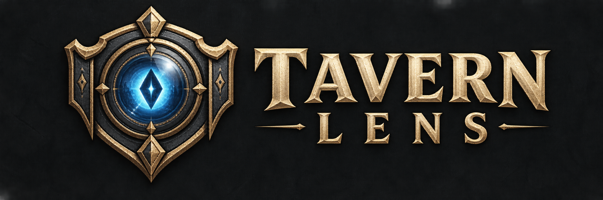
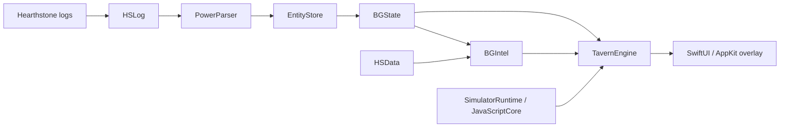

# Tavern Lens

A native macOS companion for **Hearthstone Battlegrounds**, built with Swift, SwiftUI, and AppKit. Tavern Lens reconstructs a match from Hearthstone's logs and overlays opponent history, build guidance, combat probabilities, and explainable action recommendations on the game.

I built this for my own solo Battlegrounds games on a Mac. The engineering goal is to make every useful piece of live information reproducible: the same engine drives the overlay, replays recorded games, and powers the regression tests. A confusing recommendation during a match can become a saved bookmark and, eventually, a test case.

**Status:** personal project under active development and playtesting. Built for macOS 26 on Apple Silicon; distributed here as source, with local app bundling and signing.

[Features](#features) · [Architecture](#architecture) · [Getting started](#getting-started) · [Testing](#testing) · [Engineering notes](#engineering-notes)

The recruit advisor also rates offered trinkets using current-board fit and fresh Firestone population statistics, with costs, sample counts and explicit coverage limits. It models supported discard/Sludge interactions and Dark Gift triggers; unknown effects remain labeled. See [trinket rating sources](docs/research/trinket-rating-sources.md).

## Features

| During a game | What Tavern Lens shows |
| --- | --- |
| Hero selection | Hero performance statistics adjusted for the lobby's tribes, with placement distributions and stale-data indicators. |
| Opponent scouting | Last-seen boards, tavern tiers, triples, and likely builds when hovering leaderboard portraits, plus a next-opponent preview. |
| Recruiting | Detected builds, matching shop cards, build tips, and combat estimates against the next opponent's last-seen board. |
| Combat | Win, tie, and loss probabilities, expected damage, damage ranges, and lethal risk. Results refine as simulations run. |
| Action advice | Ranked suggestions with reasons, confidence, and highlights on the relevant cards or controls. Close or uncertain choices can produce “no strong recommendation.” |
| Debugging | Log replay, an inspectable state timeline, saved game records, and feedback bookmarks that capture what the app knew and recommended. |

The app lives in the menu bar. Its overlay follows Hearthstone in windowed and native fullscreen modes, hides when neither Hearthstone nor Tavern Lens is frontmost, and passes clicks through except over its own interactive controls.

## Architecture

The UI is a consumer of a headless Swift engine. Live tracking and offline replay use the same parsing, state reconstruction, and projection code.



This is the main data flow; the package also separates overlay geometry and screen recognition from the app's OS integration.

| Module | Responsibility |
| --- | --- |
| [`HSLog`](Sources/HSLog) | Log configuration, session discovery, incremental file tailing, catch-up, and retention. |
| [`PowerParser`](Sources/PowerParser) / [`EntityStore`](Sources/EntityStore) | Typed log events and a deterministic reducer for entities, tags, zones, and controllers. |
| [`BGState`](Sources/BGState) | Battlegrounds snapshots, match history, opponent sightings, combat boundaries, and results. |
| [`HSData`](Sources/HSData) | Build-specific card data, generated enums, minion pools, card art, and cached hero and build statistics. |
| [`BGIntel`](Sources/BGIntel) | Tribe inference, build detection, hero-stat adjustments, simulator input mapping, and advisor scoring. |
| [`SimulatorRuntime`](Sources/SimulatorRuntime) | The pinned Firestone combat simulator and its card data, embedded in JavaScriptCore. |
| [`TavernEngine`](Sources/TavernEngine) | Composition of game state and intelligence into view states, simulation requests, records, and replay results. |
| [`OverlayLayout`](Sources/OverlayLayout) / [`ScreenReading`](Sources/ScreenReading) | Pure layout geometry and Vision recognition of the hero-pick tribe banner. |
| [`TavernLensApp`](Sources/TavernLensApp) | Window tracking, screen capture, permissions, menu-bar controls, and native overlay presentation. |

### Reproducible state, with deliberate timing

Hearthstone's logs contain both an early state stream and an animation-synchronized stream. Displayed gameplay state follows `PowerTaskList`; the early stream supplies metadata and choices. Updates settle at task-list boundaries before publication, so partial log batches do not become partial UI states.

The engine handles mid-game attachment, reconnects, truncated logs, and game history across sessions. Live catch-up reconstructs the existing history before publishing the current state, and UI updates are capped at roughly 10 Hz. See [`TavernEngine.swift`](Sources/TavernEngine/TavernEngine.swift) and [`LivePipeline.swift`](Sources/TavernLensApp/LivePipeline.swift).

### A JavaScript simulator inside a native Swift app

Combat simulation uses Firestone's existing simulator, bundled with esbuild and executed locally in JavaScriptCore. Its version and card database are pinned together; Node.js is a maintenance dependency, not an app runtime requirement.

JavaScript work runs on a serial background queue with bounded simulation batches, progressive results, and cancellation. Preview and advisor jobs replace obsolete work, while generation and sequence checks discard stale or out-of-order results. Golden simulations use fixed seeds and simulation counts to avoid depending on machine speed. See [`CombatSimulator.swift`](Sources/SimulatorRuntime/CombatSimulator.swift) and [`LatestRunner.swift`](Sources/TavernEngine/LatestRunner.swift).

### Advice with inspectable tradeoffs

The advisor searches short legal recruit plans using your board, hand, shop, gold, scaling engine,
and supported card effects. It compares the resulting positions and uses several recent opponent
boards plus stronger stress scenarios as survival checks. It does not optimize purchases against
only the last opponent. Unsupported effects and incomplete evaluations reduce confidence.

The overlay shows the next action and its continuation. Search depth, effect coverage and future
value estimates are bounded; the [scoring guide](docs/advisor/scoring.md) describes these limits,
confidence rules and how saved decisions can be replayed.

### Playtesting feeds the test suite

Automatic turn diagnostics retain displayed advice, its exact inputs, and combat odds without a hotkey. A feedback bookmark stores the game state, engine inputs, and the advisor request, plan, and evaluation progress. The debug window can replay bookmarks and export golden cases. That connects a problem seen during a real match to a reproducible input and an expected result.

Layout is independently testable: window bounds map to overlay rectangles through pure geometry, including windowed, notched fullscreen, and ultrawide reference frames. Screen recognition is tested against an image fixture without requiring screen-capture permission.

## Getting started

### Requirements

- **macOS 26**; Apple Silicon is the development target.
- **Swift 6.2 or newer**, through Apple's Command Line Tools or Xcode. The project supports building without Xcode.
- **Hearthstone installed locally** for live tracking. Card and statistics refreshes need network access; cached data is reused when available.
- **Node.js and npm only if rebuilding or updating the simulator.** The normal app build uses the committed simulator bundle.

### Build and launch

```sh
git clone https://github.com/PeytonNowlin/Tavern-Lens.git
cd Tavern-Lens
scripts/bundle-app.sh
open "build/Tavern Lens.app"
```

The bundling script builds a release executable, includes the SwiftPM resources, and signs the app. Use `scripts/bundle-app.sh --debug` for a debug bundle. `--install` also copies the app to `/Applications`, replacing an existing copy.

For stable permission grants across rebuilds, the script looks for a local code-signing identity named **Tavern Lens Local**. Without one, it falls back to ad-hoc signing, which can cause macOS to forget permissions after a rebuild. Run `scripts/bundle-app.sh --help` for the one-time certificate setup or use `TAVERN_SIGN_IDENTITY` to select an existing identity.

### First run

1. Open Tavern Lens and find its binoculars icon in the menu bar.
2. Launch Hearthstone. The app configures `log.config` for Power and LoadingScreen logging and updates `client.config` to remove the log size cap. If Hearthstone was already running when settings changed, follow the menu's restart notice.
3. Use the menu's permission controls as needed: **Accessibility** improves window tracking; **Screen Recording** enables reading the hero-pick tribe banner and checking alignment. Without screen reading, tribes are inferred from observed minions.
4. Start a solo Battlegrounds game. Avoid running HSTracker alongside Tavern Lens, since it can rewrite or remove the logs being tracked.

| Shortcut or menu item | Action |
| --- | --- |
| **⌃⌥H** — Control–Option–H | Hide or show the overlay. |
| **⌃⌥F** — Control–Option–F | Bookmark the current moment and add a note. |
| **Open Debug Window… → Open Log…** | Replay a `Power.log` or compressed log and inspect its timeline. |
| **Show Layout Guides** | Check overlay placement against the game window. |
| **Settings…** | Configure log, replay, card-data, and art-cache retention. |

### Local data and game interaction

Game records, bookmarks, replays, and caches live under `~/Library/Application Support/TavernLens/`. The app downloads card data, art, and statistics; state reconstruction and simulation run locally without a backend service.

Game information comes from log files and the optional hero-pick screen reading. Tavern Lens does not read game memory, automate input, or intercept game traffic. Its writes to Hearthstone's files are the logging configuration changes and retention cleanup of old log sessions. Cleanup protects the active session and sessions containing games that have not yet been journaled.

## Testing

```sh
scripts/test.sh
```

**Use this wrapper rather than plain `swift test`.** With Command Line Tools alone, SwiftPM can otherwise compile the runner, execute zero Swift Testing tests, and still exit successfully. The wrapper supplies the missing framework search path.

Tests focus on observable behavior at a few boundaries:

- **Engine replay:** view-state timelines, game records, opponent history, reconnects, mechanics, and advisor output.
- **Combat simulation:** committed battle inputs, seeded probability checks, progressive output, cancellation, and bundled-version consistency.
- **Layout and recognition:** overlay geometry across reference window sizes and tribe-banner recognition from a committed image.
- **Filesystem behavior:** log configuration repair, tailing, session discovery, catch-up, and retention against temporary directory trees.

Tests use synthetic inputs and committed data fixtures without a running game or network access. Some replay tests additionally require private captured logs and are **explicitly skipped when those logs are absent**. Raw logs can contain BattleTags and stay out of Git. The committed combat-input goldens still run without them.

To use the private fixture set, place it under `fixtures/private-logs/` or set `TAVERN_FIXTURES_DIR` to its root. [`Fixtures.swift`](Tests/TavernEngineTests/Support/Fixtures.swift) defines the expected session paths.

```sh
# Run a focused suite.
scripts/test.sh --filter CombatOdds

# Opt-in timing checks; some need the private fixture logs.
scripts/benchmark.sh -c release

# Deliberately regenerate expected output, then review the diff.
TAVERN_RECORD_GOLDENS=1 scripts/test.sh
```

Golden JSON is committed; the golden harness checks for BattleTags before accepting or writing it. Timing benchmarks are separate from the normal test run so machine load does not become a functional regression.

## Maintenance and current limits

Hearthstone patches can change tags, card pools, combat mechanics, and screen coordinates. Dependencies that affect predictions are updated deliberately:

- `scripts/update-simulator.sh <version>` pins and rebuilds the simulator and card data, runs the combat-odds checks, and restores the previous files if an update fails.
- `scripts/update-simulator.sh --rebuild` rebuilds after changes to [`Tools/Simulator/entry.js`](Tools/Simulator/entry.js).
- `scripts/update-enums.sh <hearthstone-build>` refreshes the enum snapshot used by the Swift build-time generator.
- `scripts/advisor-tune.sh <weights.json>` compares new advisor weights against recorded cases. See the [tuning instructions](docs/advisor/scoring.md#tuning-the-weights).

The current scope is **solo Battlegrounds**, with English card data and English banner recognition. Recruit-phase odds use an opponent's **last-seen** board, which may have changed. Advice is limited by the available observations, supported action modeling, and simulator coverage.

Automatic alignment checking measures the hero-pick banner and two board anchors (the gold pill and the hero's health) once per game; it cannot catch a patch that moves only another panel, such as the shop or the leaderboard. Notarized releases, automatic updates, Duos support, rating tracking, and a session-recap UI are outside the current scope. The [deviations document](docs/deviations.md) records the implemented tradeoffs against the original specification.

## Engineering notes

The repository includes the research and validation behind the implementation:

- [Product specification](docs/spec/tavern-lens-v1.md) — intended behavior, architecture, and testing boundaries.
- [Log validation](docs/research/log-validation-2026-09-22.md) and [edge cases](docs/research/log-edge-cases.md) — evidence from recorded games and the state-reconstruction rules it informed.
- [Simulator input mapping](docs/research/simulator-input-mapping.md) — translating reconstructed entities and mechanics into battle inputs.
- [Overlay coordinates](docs/research/overlay-coordinates.md) — measured geometry and reference frames.
- [Minion pools and tribe inference](docs/research/minion-pool-and-tribe-inference.md) — combining data sources with observations from the current game.
- [Advisor scoring](docs/advisor/scoring.md) — scoring terms, sanity rules, confidence, and reproducible tuning.
- [Ecosystem and data sources](docs/research/ecosystem-and-data-sources.md) — upstream projects and the rationale for the integrations.

## Credits

Tavern Lens builds on [HearthstoneJSON](https://hearthstonejson.com/) for card data and enums, [Firestone](https://github.com/Zero-to-Heroes/firestone) for combat simulation and hero/build data, and [HSReplay](https://hsreplay.net/) for minion-pool metadata. The combat engine is the upstream [`@firestone-hs/simulate-bgs-battle`](https://www.npmjs.com/package/@firestone-hs/simulate-bgs-battle) package; this project's work includes its native embedding, input mapping, scheduling, and regression coverage.

Hearthstone and its game assets belong to Blizzard Entertainment. Tavern Lens is an independent project, not affiliated with or endorsed by Blizzard Entertainment.

## License

MIT, see [LICENSE](LICENSE). Bundled third-party software and data are listed in [THIRD_PARTY_NOTICES.md](THIRD_PARTY_NOTICES.md).
